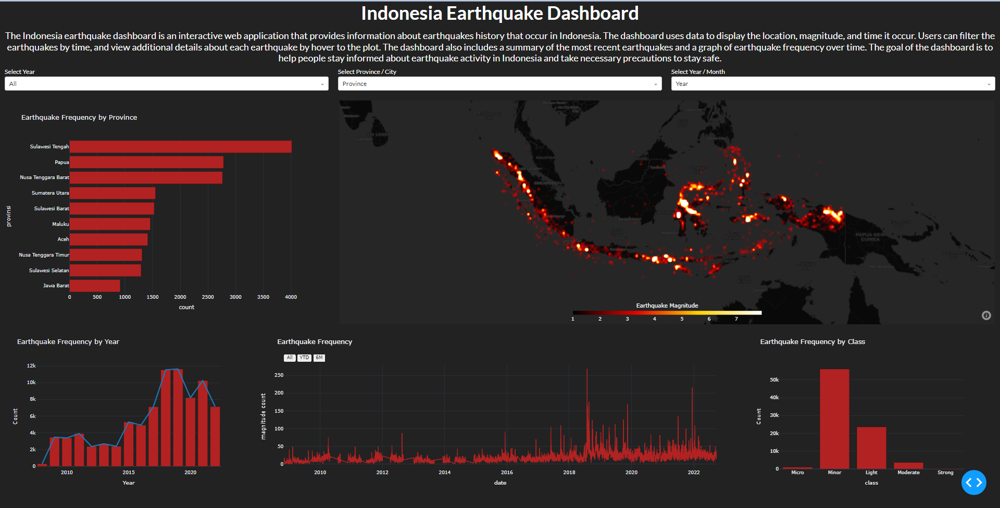

# Earthquake-Dashboard

The Indonesia earthquake dashboard is an interactive web application that provides information about earthquakes history that occur in Indonesia. The dashboard uses data to display the location, magnitude, and time it occur. Users can filter the earthquakes by time, and view additional details about each earthquake by hover to the plot. The dashboard also includes a summary of the most recent earthquakes and a graph of earthquake frequency over time. The goal of the dashboard is to help people stay informed about earthquake activity in Indonesia and take necessary precautions to stay safe.

You also can see some eartquake in indonesia fact in this link : https://www.canva.com/design/DAFgRfXz304/UGSCp-cZCO2IWUcEcPWJOw/edit?utm_content=DAFgRfXz304&utm_campaign=designshare&utm_medium=link2&utm_source=sharebutton

''
